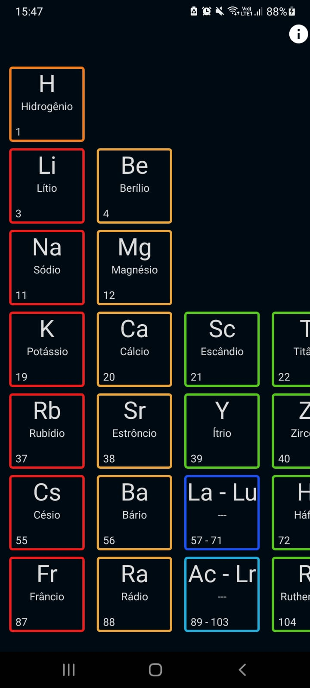
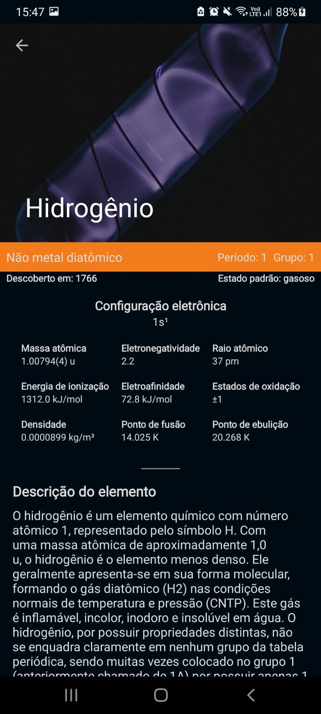
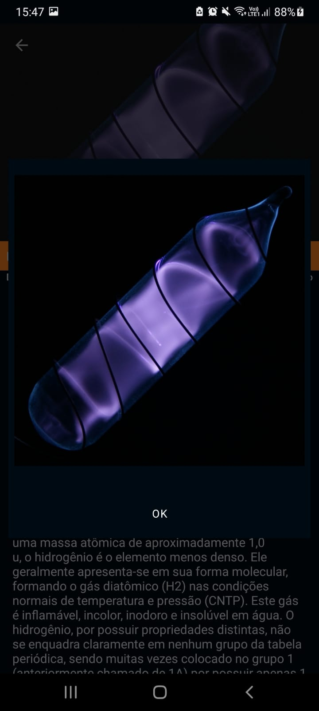
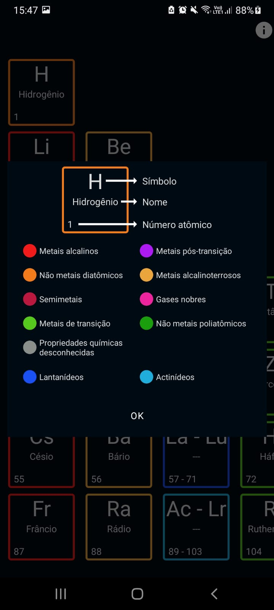
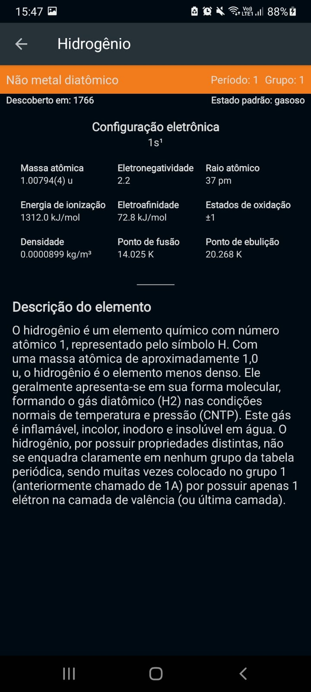

# Tabela Periódica Interativa
Aplicativo Android desenvolvido em Kotlin para trabalho da disciplina de Realidade Aumentada, da instituição Universidade Paulista (UNIP), campus Manaus - AM.
> Abril 2022

# Imagens do app
 
 

